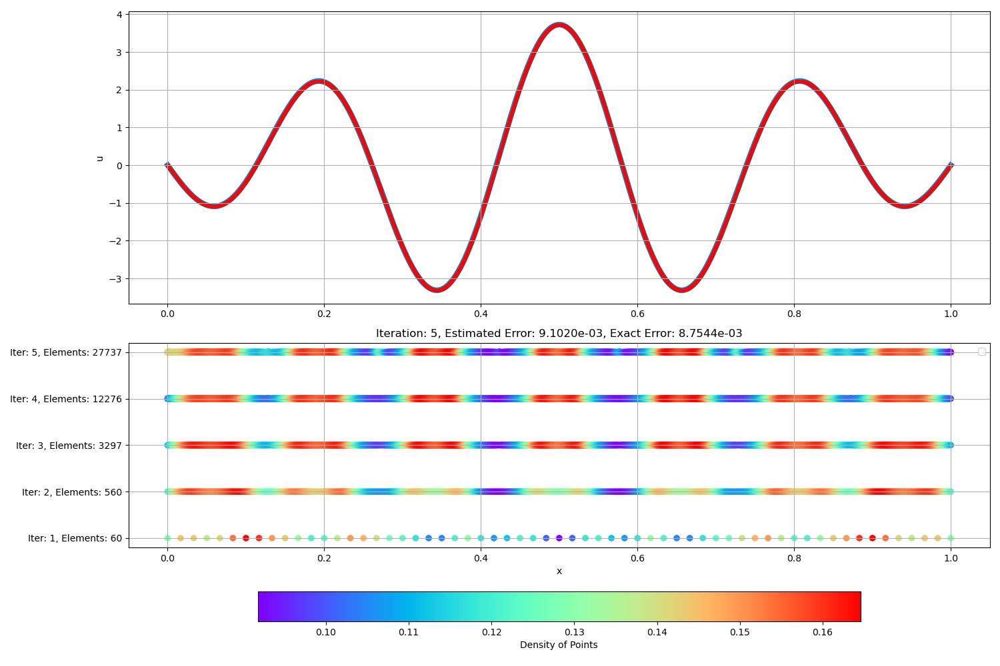

# Error Estimation for Finite Element Method

[](https://michellechaochen.github.io/error-estimate-for-fem/)
[](https://vscode.dev/redirect?url=vscode://ms-vscode-remote.remote-containers/cloneInVolume?url=https://github.com/MichelleChaoChen/error-estimate-for-fem)

## Setting up Your Environment 

Before running this project, make sure to install Docker (https://docs.docker.com/get-docker/) and Visual Studio Code (https://code.visualstudio.com/download). 

1. Open Visual Studio Code
2. Go to the Extensions Market Place
3. Get the Dev Container plugin
4. Open the Dev Container provided by this project. 
5. Clone this repository into the container. VSC will have a prompt for this to be done and it will also give you the option to login to Github on the browser. 
6. Check that all dependencies have been successfully installed. The dependencies are specified in the `Dockerfile`


## Adaptive Mesh Refinement

Run the command:

```
python3 adaptive_mesh_refinment.py
```
A visualisation of the AMR can be found in the `plots` directory. 




### Training a Model 
To train your own model, use the following command:
```
python train.py --data [path/to/data]
```
The trained model will be stored in the **src/models** folder as `*.h5` file. 

### Evaluating AMR Results

Run the command:

```
python3 convergence_experiments.py
```
The data files and the plots can be found in the `experiments` directory. 
